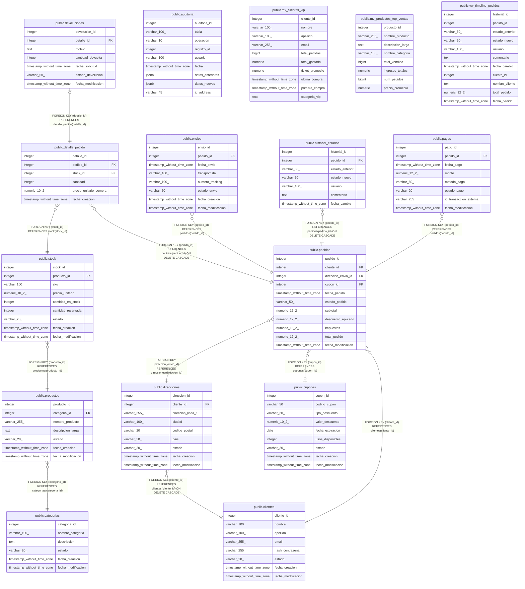

# ecommerce_db

## Tables

| Name | Columns | Comment | Type |
| ---- | ------- | ------- | ---- |
| [public.auditoria](public.auditoria.md) | 9 |  | BASE TABLE |
| [public.categorias](public.categorias.md) | 6 |  | BASE TABLE |
| [public.clientes](public.clientes.md) | 8 |  | BASE TABLE |
| [public.cupones](public.cupones.md) | 9 |  | BASE TABLE |
| [public.detalle_pedido](public.detalle_pedido.md) | 6 |  | BASE TABLE |
| [public.devoluciones](public.devoluciones.md) | 7 |  | BASE TABLE |
| [public.direcciones](public.direcciones.md) | 9 |  | BASE TABLE |
| [public.envios](public.envios.md) | 8 |  | BASE TABLE |
| [public.historial_estados](public.historial_estados.md) | 7 | Historial de cambios de estado para timeline visual de pedidos.  Complementa la tabla auditoria con información específica para UX. | BASE TABLE |
| [public.pedidos](public.pedidos.md) | 11 |  | BASE TABLE |
| [public.mv_clientes_vip](public.mv_clientes_vip.md) | 10 |  | MATERIALIZED VIEW |
| [public.productos](public.productos.md) | 7 |  | BASE TABLE |
| [public.stock](public.stock.md) | 9 |  | BASE TABLE |
| [public.mv_productos_top_ventas](public.mv_productos_top_ventas.md) | 8 |  | MATERIALIZED VIEW |
| [public.pagos](public.pagos.md) | 8 |  | BASE TABLE |
| [public.vw_timeline_pedidos](public.vw_timeline_pedidos.md) | 11 | Vista combinada de historial de estados con información del pedido y cliente.  Optimizada para listados de actividad reciente. | VIEW |

## Stored procedures and functions

| Name | ReturnType | Arguments | Type |
| ---- | ------- | ------- | ---- |
| public.fn_actualizar_fecha_modificacion | trigger |  | FUNCTION |
| public.fn_alerta_stock_bajo | record | p_limite integer DEFAULT 15 | FUNCTION |
| public.fn_auditoria_categorias | trigger |  | FUNCTION |
| public.fn_auditoria_clientes | trigger |  | FUNCTION |
| public.fn_auditoria_cupones | trigger |  | FUNCTION |
| public.fn_auditoria_generica | trigger |  | FUNCTION |
| public.fn_auditoria_pagos | trigger |  | FUNCTION |
| public.fn_auditoria_pedidos | trigger |  | FUNCTION |
| public.fn_auditoria_productos | trigger |  | FUNCTION |
| public.fn_auditoria_stock | trigger |  | FUNCTION |
| public.fn_calcular_comision_venta | numeric | p_pedido_id integer | FUNCTION |
| public.fn_calcular_descuento_cupon | numeric | p_cupon_id integer, p_subtotal numeric | FUNCTION |
| public.fn_calcular_monto_reembolso | numeric | p_detalle_id integer, p_cantidad_devuelta integer | FUNCTION |
| public.fn_calcular_puntos_fidelidad | int4 | p_cliente_id integer | FUNCTION |
| public.fn_calcular_tiempo_entrega | int4 | p_envio_id integer | FUNCTION |
| public.fn_calcular_total_pedido | numeric | p_pedido_id integer | FUNCTION |
| public.fn_calcular_total_ventas_periodo | numeric | p_fecha_desde timestamp without time zone, p_fecha_hasta timestamp without time zone | FUNCTION |
| public.fn_cambiar_estado_pedido | bool | p_pedido_id integer, p_nuevo_estado character varying, p_comentario text DEFAULT NULL::text | FUNCTION |
| public.fn_cliente_tiene_pedidos | bool | p_cliente_id integer | FUNCTION |
| public.fn_distribucion_estados_pedidos | record |  | FUNCTION |
| public.fn_estadisticas_dashboard | record |  | FUNCTION |
| public.fn_estadisticas_estados | record | p_pedido_id integer | FUNCTION |
| public.fn_historial_cambios | record | p_tabla character varying, p_registro_id integer, p_limite integer DEFAULT 50 | FUNCTION |
| public.fn_metricas_producto | record | p_producto_id integer | FUNCTION |
| public.fn_obtener_clientes_frecuentes | record | p_limite integer DEFAULT 10 | FUNCTION |
| public.fn_obtener_precio_producto | numeric | p_stock_id integer | FUNCTION |
| public.fn_obtener_productos_mas_vendidos | record | p_limite integer DEFAULT 10, p_fecha_desde timestamp without time zone DEFAULT NULL::timestamp without time zone, p_fecha_hasta timestamp without time zone DEFAULT NULL::timestamp without time zone | FUNCTION |
| public.fn_obtener_timeline_pedido | record | p_pedido_id integer | FUNCTION |
| public.fn_registrar_cambio_estado | trigger |  | FUNCTION |
| public.fn_tendencia_pedidos | record | p_dias integer DEFAULT 30 | FUNCTION |
| public.fn_validar_cupon_aplicable | bool | p_codigo_cupon character varying | FUNCTION |
| public.fn_validar_devolucion_permitida | bool | p_pedido_id integer | FUNCTION |
| public.fn_validar_stock_disponible | bool | p_stock_id integer, p_cantidad_solicitada integer | FUNCTION |
| public.fn_ventas_diarias | record | p_dias integer DEFAULT 7 | FUNCTION |
| public.fn_ventas_por_categoria | record | p_limite integer DEFAULT 10 | FUNCTION |
| public.sp_actualizar_estado_envio | void | IN p_envio_id integer, IN p_nuevo_estado character varying, IN p_transportista character varying DEFAULT NULL::character varying, IN p_numero_tracking character varying DEFAULT NULL::character varying | PROCEDURE |
| public.sp_actualizar_stock_compra | void | IN p_pedido_id integer | PROCEDURE |
| public.sp_ajustar_precios_categoria | void | IN p_categoria_id integer, IN p_porcentaje_ajuste numeric | PROCEDURE |
| public.sp_aplicar_cupon_pedido | void | IN p_pedido_id integer, IN p_codigo_cupon character varying | PROCEDURE |
| public.sp_cancelar_pedido | void | IN p_pedido_id integer, IN p_motivo text | PROCEDURE |
| public.sp_crear_pedido | record | IN p_cliente_id integer, IN p_direccion_envio_id integer, IN p_cupon_id integer, IN p_items jsonb, OUT p_pedido_id integer | PROCEDURE |
| public.sp_eliminar_cliente | void | IN p_cliente_id integer | PROCEDURE |
| public.sp_eliminar_pago | void | IN p_pago_id integer | PROCEDURE |
| public.sp_eliminar_pedido | void | IN p_pedido_id integer | PROCEDURE |
| public.sp_eliminar_producto | void | IN p_producto_id integer | PROCEDURE |
| public.sp_eliminar_stock | void | IN p_stock_id integer | PROCEDURE |
| public.sp_procesar_devolucion | void | IN p_detalle_id integer, IN p_cantidad_devuelta integer, IN p_motivo text | PROCEDURE |
| public.sp_procesar_pago | void | IN p_pedido_id integer, IN p_monto numeric, IN p_metodo_pago character varying, IN p_id_transaccion character varying | PROCEDURE |
| public.sp_reabastecer_stock | void | IN p_stock_id integer, IN p_cantidad integer, IN p_costo_unitario numeric DEFAULT NULL::numeric | PROCEDURE |

## Relations

---

> Generated by [tbls](https://github.com/k1LoW/tbls)
