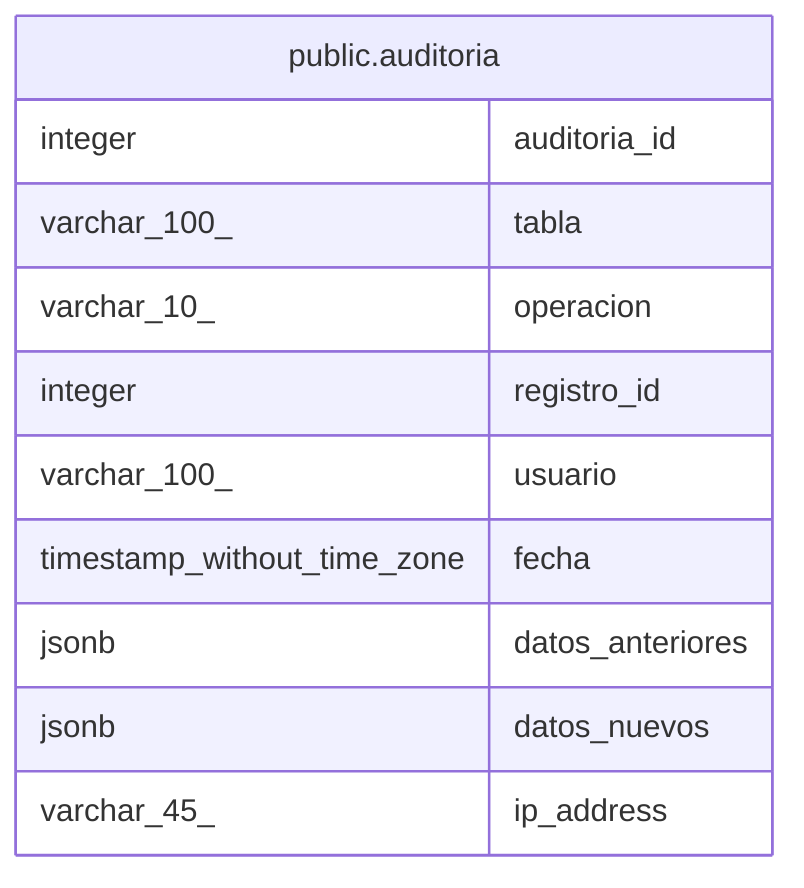

# public.auditoria

## Columns

| Name | Type | Default | Nullable | Children | Parents | Comment |
| ---- | ---- | ------- | -------- | -------- | ------- | ------- |
| auditoria_id | integer | nextval('auditoria_auditoria_id_seq'::regclass) | false |  |  |  |
| tabla | varchar(100) |  | false |  |  |  |
| operacion | varchar(10) |  | false |  |  |  |
| registro_id | integer |  | false |  |  |  |
| usuario | varchar(100) |  | true |  |  |  |
| fecha | timestamp without time zone | now() | false |  |  |  |
| datos_anteriores | jsonb |  | true |  |  |  |
| datos_nuevos | jsonb |  | true |  |  |  |
| ip_address | varchar(45) |  | true |  |  |  |

## Constraints

| Name | Type | Definition |
| ---- | ---- | ---------- |
| auditoria_operacion_check | CHECK | CHECK (((operacion)::text = ANY (ARRAY[('INSERT'::character varying)::text, ('UPDATE'::character varying)::text, ('DELETE'::character varying)::text]))) |
| auditoria_pkey | PRIMARY KEY | PRIMARY KEY (auditoria_id) |

## Indexes

| Name | Definition |
| ---- | ---------- |
| auditoria_pkey | CREATE UNIQUE INDEX auditoria_pkey ON public.auditoria USING btree (auditoria_id) |
| idx_auditoria_fecha | CREATE INDEX idx_auditoria_fecha ON public.auditoria USING btree (fecha) |
| idx_auditoria_registro | CREATE INDEX idx_auditoria_registro ON public.auditoria USING btree (registro_id) |
| idx_auditoria_tabla | CREATE INDEX idx_auditoria_tabla ON public.auditoria USING btree (tabla) |
| idx_auditoria_usuario | CREATE INDEX idx_auditoria_usuario ON public.auditoria USING btree (usuario) |

## Relations

---

> Generated by [tbls](https://github.com/k1LoW/tbls)
