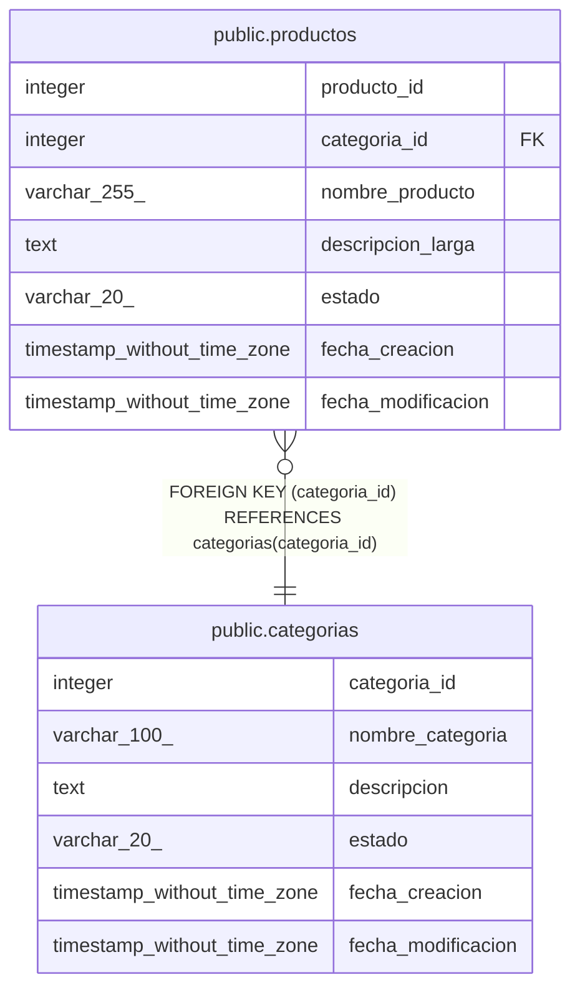

# public.categorias

## Columns

| Name | Type | Default | Nullable | Children | Parents | Comment |
| ---- | ---- | ------- | -------- | -------- | ------- | ------- |
| categoria_id | integer | nextval('categorias_categoria_id_seq'::regclass) | false | [public.productos](public.productos.md) |  |  |
| nombre_categoria | varchar(100) |  | false |  |  |  |
| descripcion | text |  | true |  |  |  |
| estado | varchar(20) | 'activo'::character varying | false |  |  |  |
| fecha_creacion | timestamp without time zone | now() | false |  |  |  |
| fecha_modificacion | timestamp without time zone |  | true |  |  |  |

## Constraints

| Name | Type | Definition |
| ---- | ---- | ---------- |
| categorias_estado_check | CHECK | CHECK (((estado)::text = ANY (ARRAY[('activo'::character varying)::text, ('inactivo'::character varying)::text]))) |
| categorias_nombre_categoria_key | UNIQUE | UNIQUE (nombre_categoria) |
| categorias_pkey | PRIMARY KEY | PRIMARY KEY (categoria_id) |

## Indexes

| Name | Definition |
| ---- | ---------- |
| categorias_nombre_categoria_key | CREATE UNIQUE INDEX categorias_nombre_categoria_key ON public.categorias USING btree (nombre_categoria) |
| categorias_pkey | CREATE UNIQUE INDEX categorias_pkey ON public.categorias USING btree (categoria_id) |

## Triggers

| Name | Definition |
| ---- | ---------- |
| trg_auditoria_categorias | CREATE TRIGGER trg_auditoria_categorias AFTER INSERT OR DELETE OR UPDATE ON public.categorias FOR EACH ROW EXECUTE FUNCTION fn_auditoria_categorias() |
| trg_categorias_modificacion | CREATE TRIGGER trg_categorias_modificacion BEFORE UPDATE ON public.categorias FOR EACH ROW EXECUTE FUNCTION fn_actualizar_fecha_modificacion() |

## Relations

---

> Generated by [tbls](https://github.com/k1LoW/tbls)
