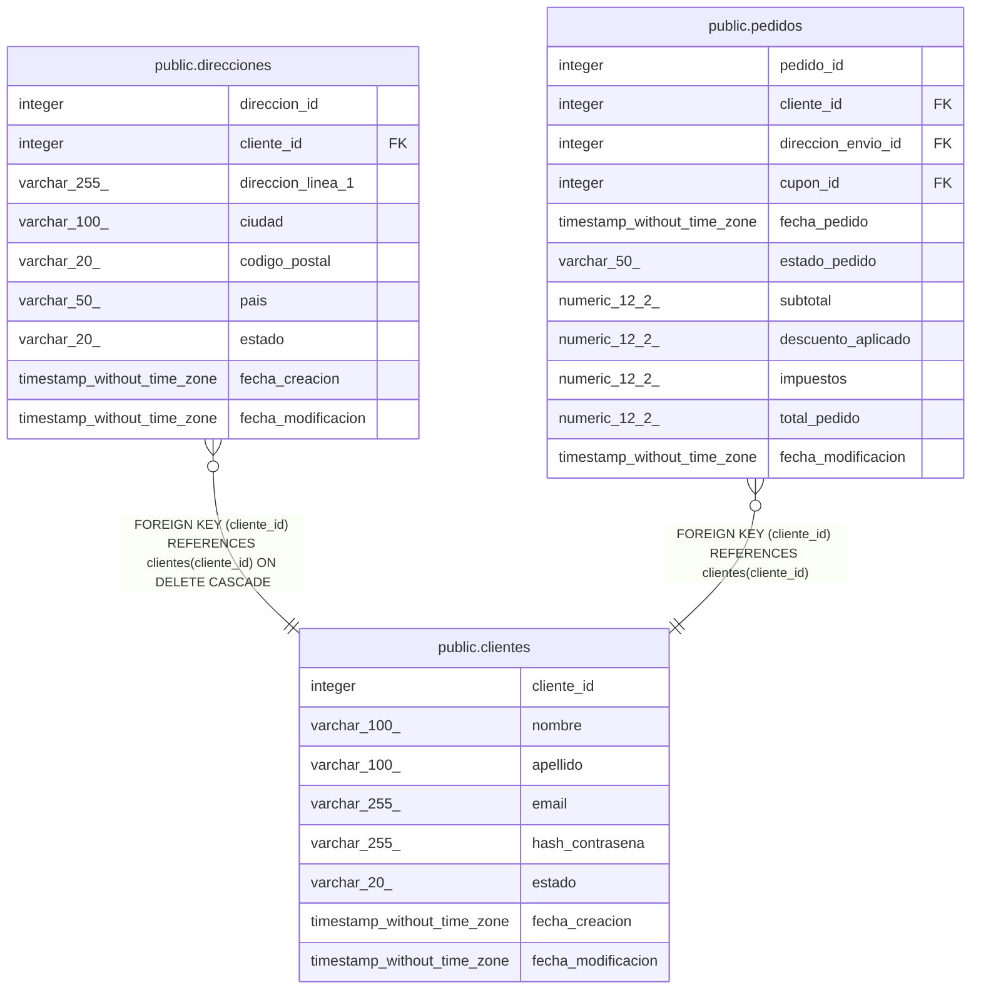

# public.clientes

## Columns

| Name | Type | Default | Nullable | Children | Parents | Comment |
| ---- | ---- | ------- | -------- | -------- | ------- | ------- |
| cliente_id | integer | nextval('clientes_cliente_id_seq'::regclass) | false | [public.direcciones](public.direcciones.md) [public.pedidos](public.pedidos.md) |  |  |
| nombre | varchar(100) |  | false |  |  |  |
| apellido | varchar(100) |  | false |  |  |  |
| email | varchar(255) |  | false |  |  |  |
| hash_contrasena | varchar(255) |  | false |  |  |  |
| estado | varchar(20) | 'activo'::character varying | false |  |  |  |
| fecha_creacion | timestamp without time zone | now() | false |  |  |  |
| fecha_modificacion | timestamp without time zone |  | true |  |  |  |

## Constraints

| Name | Type | Definition |
| ---- | ---- | ---------- |
| clientes_estado_check | CHECK | CHECK (((estado)::text = ANY (ARRAY[('activo'::character varying)::text, ('inactivo'::character varying)::text, ('suspendido'::character varying)::text]))) |
| clientes_email_key | UNIQUE | UNIQUE (email) |
| clientes_pkey | PRIMARY KEY | PRIMARY KEY (cliente_id) |

## Indexes

| Name | Definition |
| ---- | ---------- |
| clientes_email_key | CREATE UNIQUE INDEX clientes_email_key ON public.clientes USING btree (email) |
| clientes_pkey | CREATE UNIQUE INDEX clientes_pkey ON public.clientes USING btree (cliente_id) |

## Triggers

| Name | Definition |
| ---- | ---------- |
| trg_auditoria_clientes | CREATE TRIGGER trg_auditoria_clientes AFTER INSERT OR DELETE OR UPDATE ON public.clientes FOR EACH ROW EXECUTE FUNCTION fn_auditoria_clientes() |
| trg_clientes_modificacion | CREATE TRIGGER trg_clientes_modificacion BEFORE UPDATE ON public.clientes FOR EACH ROW EXECUTE FUNCTION fn_actualizar_fecha_modificacion() |

## Relations

---

> Generated by [tbls](https://github.com/k1LoW/tbls)
