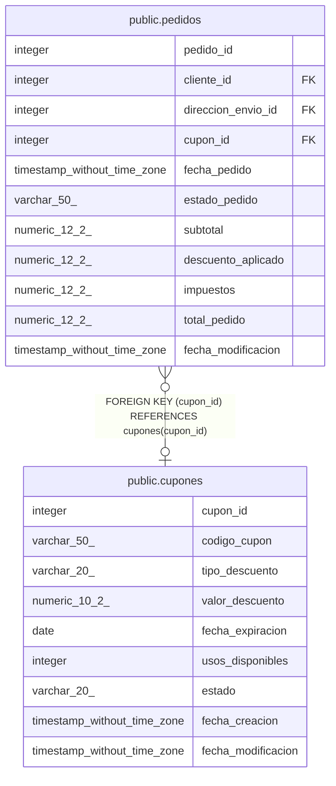

# public.cupones

## Columns

| Name | Type | Default | Nullable | Children | Parents | Comment |
| ---- | ---- | ------- | -------- | -------- | ------- | ------- |
| cupon_id | integer | nextval('cupones_cupon_id_seq'::regclass) | false | [public.pedidos](public.pedidos.md) |  |  |
| codigo_cupon | varchar(50) |  | false |  |  |  |
| tipo_descuento | varchar(20) |  | false |  |  |  |
| valor_descuento | numeric(10,2) |  | false |  |  |  |
| fecha_expiracion | date |  | true |  |  |  |
| usos_disponibles | integer |  | true |  |  |  |
| estado | varchar(20) | 'activo'::character varying | false |  |  |  |
| fecha_creacion | timestamp without time zone | now() | false |  |  |  |
| fecha_modificacion | timestamp without time zone |  | true |  |  |  |

## Constraints

| Name | Type | Definition |
| ---- | ---- | ---------- |
| cupones_estado_check | CHECK | CHECK (((estado)::text = ANY (ARRAY[('activo'::character varying)::text, ('inactivo'::character varying)::text, ('expirado'::character varying)::text]))) |
| cupones_tipo_descuento_check | CHECK | CHECK (((tipo_descuento)::text = ANY (ARRAY[('porcentaje'::character varying)::text, ('fijo'::character varying)::text]))) |
| cupones_usos_disponibles_check | CHECK | CHECK ((usos_disponibles >= 0)) |
| cupones_valor_descuento_check | CHECK | CHECK ((valor_descuento > (0)::numeric)) |
| cupones_codigo_cupon_key | UNIQUE | UNIQUE (codigo_cupon) |
| cupones_pkey | PRIMARY KEY | PRIMARY KEY (cupon_id) |

## Indexes

| Name | Definition |
| ---- | ---------- |
| cupones_codigo_cupon_key | CREATE UNIQUE INDEX cupones_codigo_cupon_key ON public.cupones USING btree (codigo_cupon) |
| cupones_pkey | CREATE UNIQUE INDEX cupones_pkey ON public.cupones USING btree (cupon_id) |
| idx_cupones_codigo | CREATE INDEX idx_cupones_codigo ON public.cupones USING btree (codigo_cupon) |

## Triggers

| Name | Definition |
| ---- | ---------- |
| trg_auditoria_cupones | CREATE TRIGGER trg_auditoria_cupones AFTER INSERT OR DELETE OR UPDATE ON public.cupones FOR EACH ROW EXECUTE FUNCTION fn_auditoria_cupones() |
| trg_cupones_modificacion | CREATE TRIGGER trg_cupones_modificacion BEFORE UPDATE ON public.cupones FOR EACH ROW EXECUTE FUNCTION fn_actualizar_fecha_modificacion() |

## Relations

---

> Generated by [tbls](https://github.com/k1LoW/tbls)
