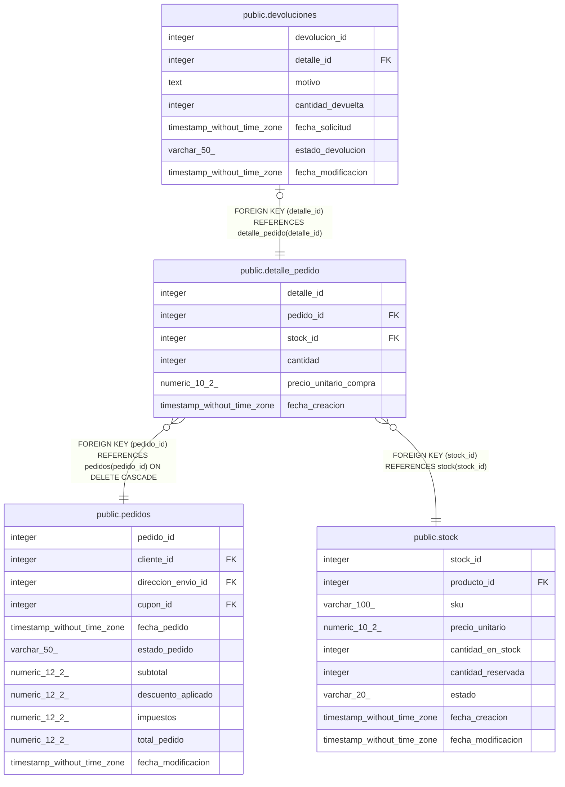

# public.detalle_pedido

## Columns

| Name | Type | Default | Nullable | Children | Parents | Comment |
| ---- | ---- | ------- | -------- | -------- | ------- | ------- |
| detalle_id | integer | nextval('detalle_pedido_detalle_id_seq'::regclass) | false | [public.devoluciones](public.devoluciones.md) |  |  |
| pedido_id | integer |  | false |  | [public.pedidos](public.pedidos.md) |  |
| stock_id | integer |  | false |  | [public.stock](public.stock.md) |  |
| cantidad | integer |  | false |  |  |  |
| precio_unitario_compra | numeric(10,2) |  | false |  |  |  |
| fecha_creacion | timestamp without time zone | now() | false |  |  |  |

## Constraints

| Name | Type | Definition |
| ---- | ---- | ---------- |
| detalle_pedido_cantidad_check | CHECK | CHECK ((cantidad > 0)) |
| detalle_pedido_pkey | PRIMARY KEY | PRIMARY KEY (detalle_id) |
| detalle_pedido_pedido_id_fkey | FOREIGN KEY | FOREIGN KEY (pedido_id) REFERENCES pedidos(pedido_id) ON DELETE CASCADE |
| detalle_pedido_stock_id_fkey | FOREIGN KEY | FOREIGN KEY (stock_id) REFERENCES stock(stock_id) |

## Indexes

| Name | Definition |
| ---- | ---------- |
| detalle_pedido_pkey | CREATE UNIQUE INDEX detalle_pedido_pkey ON public.detalle_pedido USING btree (detalle_id) |
| idx_detalle_pedido_pedido_id | CREATE INDEX idx_detalle_pedido_pedido_id ON public.detalle_pedido USING btree (pedido_id) |
| idx_detalle_pedido_stock | CREATE INDEX idx_detalle_pedido_stock ON public.detalle_pedido USING btree (stock_id) |

## Relations

---

> Generated by [tbls](https://github.com/k1LoW/tbls)
