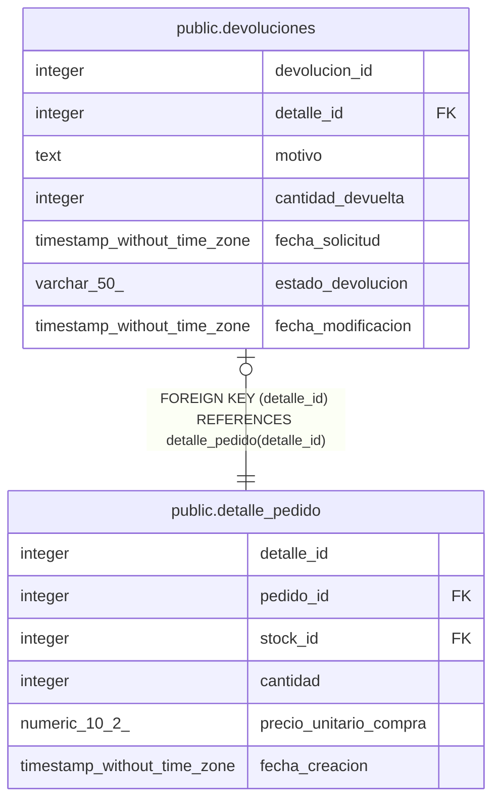

# public.devoluciones

## Columns

| Name | Type | Default | Nullable | Children | Parents | Comment |
| ---- | ---- | ------- | -------- | -------- | ------- | ------- |
| devolucion_id | integer | nextval('devoluciones_devolucion_id_seq'::regclass) | false |  |  |  |
| detalle_id | integer |  | false |  | [public.detalle_pedido](public.detalle_pedido.md) |  |
| motivo | text |  | true |  |  |  |
| cantidad_devuelta | integer |  | false |  |  |  |
| fecha_solicitud | timestamp without time zone | now() | false |  |  |  |
| estado_devolucion | varchar(50) | 'solicitada'::character varying | false |  |  |  |
| fecha_modificacion | timestamp without time zone |  | true |  |  |  |

## Constraints

| Name | Type | Definition |
| ---- | ---- | ---------- |
| devoluciones_cantidad_devuelta_check | CHECK | CHECK ((cantidad_devuelta > 0)) |
| devoluciones_estado_devolucion_check | CHECK | CHECK (((estado_devolucion)::text = ANY (ARRAY[('solicitada'::character varying)::text, ('aprobada'::character varying)::text, ('recibida'::character varying)::text, ('reembolsada'::character varying)::text, ('rechazada'::character varying)::text]))) |
| devoluciones_detalle_id_fkey | FOREIGN KEY | FOREIGN KEY (detalle_id) REFERENCES detalle_pedido(detalle_id) |
| devoluciones_detalle_id_key | UNIQUE | UNIQUE (detalle_id) |
| devoluciones_pkey | PRIMARY KEY | PRIMARY KEY (devolucion_id) |

## Indexes

| Name | Definition |
| ---- | ---------- |
| devoluciones_detalle_id_key | CREATE UNIQUE INDEX devoluciones_detalle_id_key ON public.devoluciones USING btree (detalle_id) |
| devoluciones_pkey | CREATE UNIQUE INDEX devoluciones_pkey ON public.devoluciones USING btree (devolucion_id) |
| idx_devoluciones_detalle | CREATE INDEX idx_devoluciones_detalle ON public.devoluciones USING btree (detalle_id) |

## Triggers

| Name | Definition |
| ---- | ---------- |
| trg_devoluciones_modificacion | CREATE TRIGGER trg_devoluciones_modificacion BEFORE UPDATE ON public.devoluciones FOR EACH ROW EXECUTE FUNCTION fn_actualizar_fecha_modificacion() |

## Relations

---

> Generated by [tbls](https://github.com/k1LoW/tbls)
