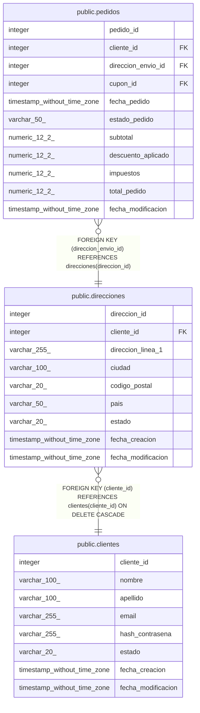

# public.direcciones

## Columns

| Name | Type | Default | Nullable | Children | Parents | Comment |
| ---- | ---- | ------- | -------- | -------- | ------- | ------- |
| direccion_id | integer | nextval('direcciones_direccion_id_seq'::regclass) | false | [public.pedidos](public.pedidos.md) |  |  |
| cliente_id | integer |  | false |  | [public.clientes](public.clientes.md) |  |
| direccion_linea_1 | varchar(255) |  | false |  |  |  |
| ciudad | varchar(100) |  | false |  |  |  |
| codigo_postal | varchar(20) |  | false |  |  |  |
| pais | varchar(50) |  | false |  |  |  |
| estado | varchar(20) | 'activo'::character varying | false |  |  |  |
| fecha_creacion | timestamp without time zone | now() | false |  |  |  |
| fecha_modificacion | timestamp without time zone |  | true |  |  |  |

## Constraints

| Name | Type | Definition |
| ---- | ---- | ---------- |
| direcciones_estado_check | CHECK | CHECK (((estado)::text = ANY (ARRAY[('activo'::character varying)::text, ('inactivo'::character varying)::text]))) |
| direcciones_cliente_id_fkey | FOREIGN KEY | FOREIGN KEY (cliente_id) REFERENCES clientes(cliente_id) ON DELETE CASCADE |
| direcciones_pkey | PRIMARY KEY | PRIMARY KEY (direccion_id) |

## Indexes

| Name | Definition |
| ---- | ---------- |
| direcciones_pkey | CREATE UNIQUE INDEX direcciones_pkey ON public.direcciones USING btree (direccion_id) |
| idx_direcciones_cliente | CREATE INDEX idx_direcciones_cliente ON public.direcciones USING btree (cliente_id) |

## Triggers

| Name | Definition |
| ---- | ---------- |
| trg_direcciones_modificacion | CREATE TRIGGER trg_direcciones_modificacion BEFORE UPDATE ON public.direcciones FOR EACH ROW EXECUTE FUNCTION fn_actualizar_fecha_modificacion() |

## Relations

---

> Generated by [tbls](https://github.com/k1LoW/tbls)
