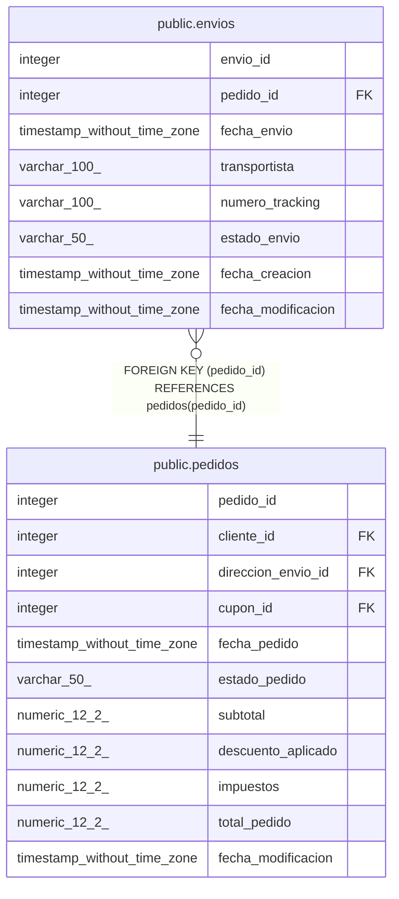

# public.envios

## Columns

| Name | Type | Default | Nullable | Children | Parents | Comment |
| ---- | ---- | ------- | -------- | -------- | ------- | ------- |
| envio_id | integer | nextval('envios_envio_id_seq'::regclass) | false |  |  |  |
| pedido_id | integer |  | false |  | [public.pedidos](public.pedidos.md) |  |
| fecha_envio | timestamp without time zone |  | true |  |  |  |
| transportista | varchar(100) |  | true |  |  |  |
| numero_tracking | varchar(100) |  | true |  |  |  |
| estado_envio | varchar(50) | 'en_preparacion'::character varying | false |  |  |  |
| fecha_creacion | timestamp without time zone | now() | false |  |  |  |
| fecha_modificacion | timestamp without time zone |  | true |  |  |  |

## Constraints

| Name | Type | Definition |
| ---- | ---- | ---------- |
| envios_estado_envio_check | CHECK | CHECK (((estado_envio)::text = ANY (ARRAY[('en_preparacion'::character varying)::text, ('en_transito'::character varying)::text, ('entregado'::character varying)::text, ('fallido'::character varying)::text]))) |
| envios_pkey | PRIMARY KEY | PRIMARY KEY (envio_id) |
| envios_pedido_id_fkey | FOREIGN KEY | FOREIGN KEY (pedido_id) REFERENCES pedidos(pedido_id) |

## Indexes

| Name | Definition |
| ---- | ---------- |
| envios_pkey | CREATE UNIQUE INDEX envios_pkey ON public.envios USING btree (envio_id) |
| idx_envios_estado | CREATE INDEX idx_envios_estado ON public.envios USING btree (estado_envio) |
| idx_envios_numero_tracking | CREATE INDEX idx_envios_numero_tracking ON public.envios USING btree (numero_tracking) |
| idx_envios_pedido | CREATE INDEX idx_envios_pedido ON public.envios USING btree (pedido_id) |

## Triggers

| Name | Definition |
| ---- | ---------- |
| trg_envios_modificacion | CREATE TRIGGER trg_envios_modificacion BEFORE UPDATE ON public.envios FOR EACH ROW EXECUTE FUNCTION fn_actualizar_fecha_modificacion() |

## Relations

---

> Generated by [tbls](https://github.com/k1LoW/tbls)
