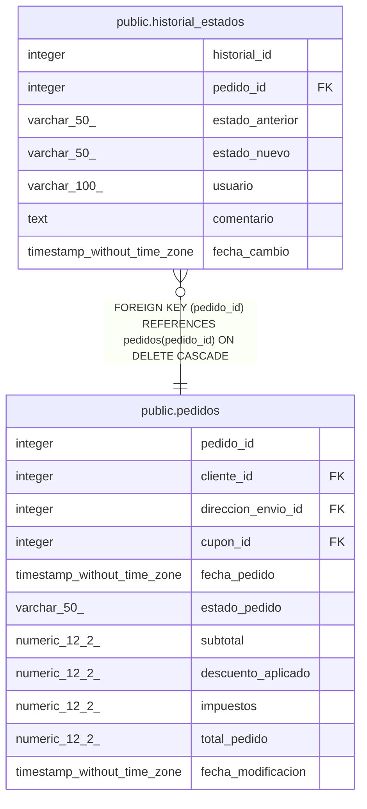

# public.historial_estados

## Description

Historial de cambios de estado para timeline visual de pedidos.   
Complementa la tabla auditoria con información específica para UX.

## Columns

| Name | Type | Default | Nullable | Children | Parents | Comment |
| ---- | ---- | ------- | -------- | -------- | ------- | ------- |
| historial_id | integer | nextval('historial_estados_historial_id_seq'::regclass) | false |  |  |  |
| pedido_id | integer |  | false |  | [public.pedidos](public.pedidos.md) |  |
| estado_anterior | varchar(50) |  | true |  |  | Estado previo del pedido. NULL para el estado inicial (creación). |
| estado_nuevo | varchar(50) |  | false |  |  |  |
| usuario | varchar(100) | CURRENT_USER | true |  |  |  |
| comentario | text |  | true |  |  | Nota o motivo del cambio de estado (ej: "Pedido enviado por FedEx", "Cancelado por cliente"). |
| fecha_cambio | timestamp without time zone | now() | false |  |  |  |

## Constraints

| Name | Type | Definition |
| ---- | ---- | ---------- |
| chk_estado_anterior | CHECK | CHECK ((((estado_anterior)::text = ANY (ARRAY[('pendiente'::character varying)::text, ('pagado'::character varying)::text, ('enviado'::character varying)::text, ('cancelado'::character varying)::text, ('completado'::character varying)::text])) OR (estado_anterior IS NULL))) |
| chk_estado_nuevo | CHECK | CHECK (((estado_nuevo)::text = ANY (ARRAY[('pendiente'::character varying)::text, ('pagado'::character varying)::text, ('enviado'::character varying)::text, ('cancelado'::character varying)::text, ('completado'::character varying)::text]))) |
| historial_estados_pkey | PRIMARY KEY | PRIMARY KEY (historial_id) |
| historial_estados_pedido_id_fkey | FOREIGN KEY | FOREIGN KEY (pedido_id) REFERENCES pedidos(pedido_id) ON DELETE CASCADE |

## Indexes

| Name | Definition |
| ---- | ---------- |
| historial_estados_pkey | CREATE UNIQUE INDEX historial_estados_pkey ON public.historial_estados USING btree (historial_id) |
| idx_historial_estados_fecha | CREATE INDEX idx_historial_estados_fecha ON public.historial_estados USING btree (fecha_cambio DESC) |
| idx_historial_estados_pedido | CREATE INDEX idx_historial_estados_pedido ON public.historial_estados USING btree (pedido_id, fecha_cambio DESC) |

## Relations

---

> Generated by [tbls](https://github.com/k1LoW/tbls)
