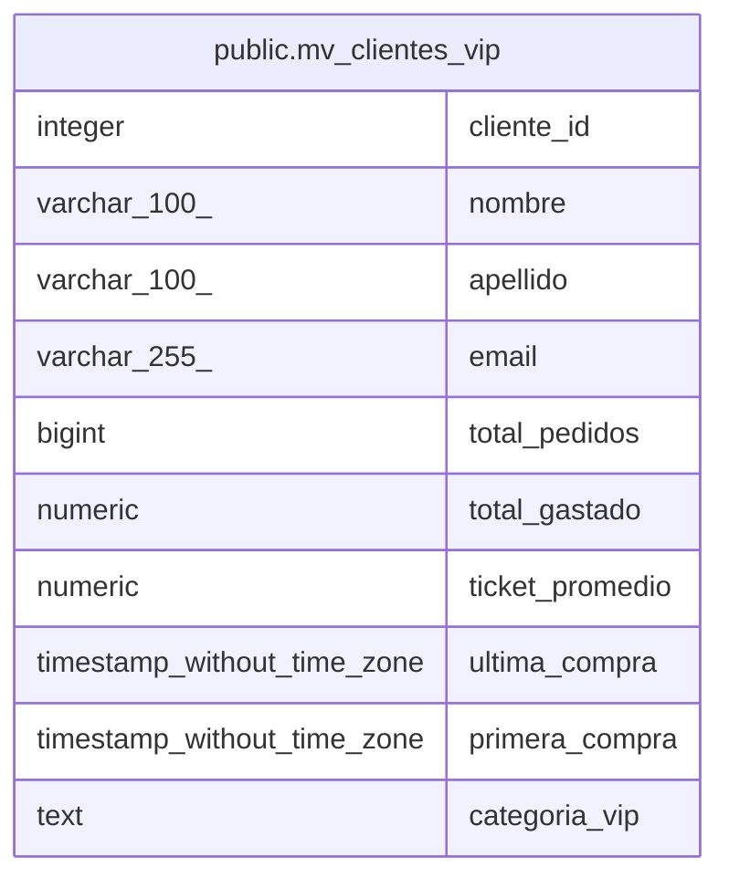

# public.mv_clientes_vip

## Description

<details>
<summary><strong>Table Definition</strong></summary>

```sql
CREATE MATERIALIZED VIEW mv_clientes_vip AS (
 SELECT c.cliente_id,
    c.nombre,
    c.apellido,
    c.email,
    count(p.pedido_id) AS total_pedidos,
    sum(p.total_pedido) AS total_gastado,
    avg(p.total_pedido) AS ticket_promedio,
    max(p.fecha_pedido) AS ultima_compra,
    min(p.fecha_pedido) AS primera_compra,
        CASE
            WHEN (sum(p.total_pedido) >= (1000)::numeric) THEN 'Platinum'::text
            WHEN (sum(p.total_pedido) >= (500)::numeric) THEN 'Gold'::text
            WHEN (count(p.pedido_id) >= 5) THEN 'Silver'::text
            ELSE 'Bronze'::text
        END AS categoria_vip
   FROM (clientes c
     JOIN pedidos p ON ((c.cliente_id = p.cliente_id)))
  WHERE (((p.estado_pedido)::text = ANY (ARRAY[('pagado'::character varying)::text, ('enviado'::character varying)::text, ('completado'::character varying)::text])) AND ((c.estado)::text = 'activo'::text))
  GROUP BY c.cliente_id, c.nombre, c.apellido, c.email
 HAVING ((count(p.pedido_id) >= 3) OR (sum(p.total_pedido) >= (500)::numeric))
  ORDER BY (sum(p.total_pedido)) DESC
)
```

</details>

## Columns

| Name | Type | Default | Nullable | Children | Parents | Comment |
| ---- | ---- | ------- | -------- | -------- | ------- | ------- |
| cliente_id | integer |  | true |  |  |  |
| nombre | varchar(100) |  | true |  |  |  |
| apellido | varchar(100) |  | true |  |  |  |
| email | varchar(255) |  | true |  |  |  |
| total_pedidos | bigint |  | true |  |  |  |
| total_gastado | numeric |  | true |  |  |  |
| ticket_promedio | numeric |  | true |  |  |  |
| ultima_compra | timestamp without time zone |  | true |  |  |  |
| primera_compra | timestamp without time zone |  | true |  |  |  |
| categoria_vip | text |  | true |  |  |  |

## Referenced Tables

| Name | Columns | Comment | Type |
| ---- | ------- | ------- | ---- |
| [public.clientes](public.clientes.md) | 8 |  | BASE TABLE |
| [public.pedidos](public.pedidos.md) | 11 |  | BASE TABLE |

## Indexes

| Name | Definition |
| ---- | ---------- |
| idx_mv_clientes_vip_categoria | CREATE INDEX idx_mv_clientes_vip_categoria ON public.mv_clientes_vip USING btree (categoria_vip) |
| idx_mv_clientes_vip_id | CREATE UNIQUE INDEX idx_mv_clientes_vip_id ON public.mv_clientes_vip USING btree (cliente_id) |

## Relations



---

> Generated by [tbls](https://github.com/k1LoW/tbls)
