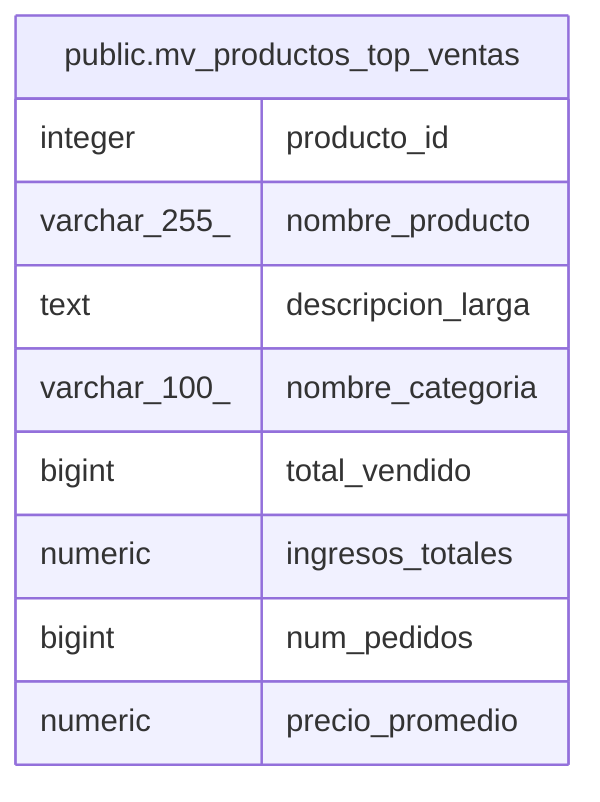

# public.mv_productos_top_ventas

## Description

<details>
<summary><strong>Table Definition</strong></summary>

```sql
CREATE MATERIALIZED VIEW mv_productos_top_ventas AS (
 SELECT p.producto_id,
    p.nombre_producto,
    p.descripcion_larga,
    c.nombre_categoria,
    sum(dp.cantidad) AS total_vendido,
    sum(((dp.cantidad)::numeric * dp.precio_unitario_compra)) AS ingresos_totales,
    count(DISTINCT ped.pedido_id) AS num_pedidos,
    avg(dp.precio_unitario_compra) AS precio_promedio
   FROM ((((productos p
     JOIN categorias c ON ((p.categoria_id = c.categoria_id)))
     JOIN stock s ON ((p.producto_id = s.producto_id)))
     JOIN detalle_pedido dp ON ((s.stock_id = dp.stock_id)))
     JOIN pedidos ped ON ((dp.pedido_id = ped.pedido_id)))
  WHERE (((ped.estado_pedido)::text = ANY (ARRAY[('pagado'::character varying)::text, ('enviado'::character varying)::text, ('completado'::character varying)::text])) AND ((p.estado)::text = 'activo'::text))
  GROUP BY p.producto_id, p.nombre_producto, p.descripcion_larga, c.nombre_categoria
  ORDER BY (sum(dp.cantidad)) DESC
)
```

</details>

## Columns

| Name | Type | Default | Nullable | Children | Parents | Comment |
| ---- | ---- | ------- | -------- | -------- | ------- | ------- |
| producto_id | integer |  | true |  |  |  |
| nombre_producto | varchar(255) |  | true |  |  |  |
| descripcion_larga | text |  | true |  |  |  |
| nombre_categoria | varchar(100) |  | true |  |  |  |
| total_vendido | bigint |  | true |  |  |  |
| ingresos_totales | numeric |  | true |  |  |  |
| num_pedidos | bigint |  | true |  |  |  |
| precio_promedio | numeric |  | true |  |  |  |

## Referenced Tables

| Name | Columns | Comment | Type |
| ---- | ------- | ------- | ---- |
| [public.productos](public.productos.md) | 7 |  | BASE TABLE |
| [public.categorias](public.categorias.md) | 6 |  | BASE TABLE |
| [public.stock](public.stock.md) | 9 |  | BASE TABLE |
| [public.detalle_pedido](public.detalle_pedido.md) | 6 |  | BASE TABLE |
| [public.pedidos](public.pedidos.md) | 11 |  | BASE TABLE |

## Indexes

| Name | Definition |
| ---- | ---------- |
| idx_mv_productos_top_ventas_id | CREATE UNIQUE INDEX idx_mv_productos_top_ventas_id ON public.mv_productos_top_ventas USING btree (producto_id) |

## Relations



---

> Generated by [tbls](https://github.com/k1LoW/tbls)
