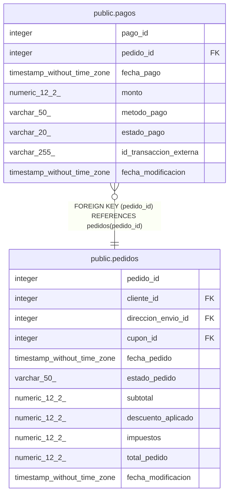

# public.pagos

## Columns

| Name | Type | Default | Nullable | Children | Parents | Comment |
| ---- | ---- | ------- | -------- | -------- | ------- | ------- |
| pago_id | integer | nextval('pagos_pago_id_seq'::regclass) | false |  |  |  |
| pedido_id | integer |  | false |  | [public.pedidos](public.pedidos.md) |  |
| fecha_pago | timestamp without time zone | now() | false |  |  |  |
| monto | numeric(12,2) |  | false |  |  |  |
| metodo_pago | varchar(50) |  | true |  |  |  |
| estado_pago | varchar(20) |  | false |  |  |  |
| id_transaccion_externa | varchar(255) |  | true |  |  |  |
| fecha_modificacion | timestamp without time zone |  | true |  |  |  |

## Constraints

| Name | Type | Definition |
| ---- | ---- | ---------- |
| pagos_estado_pago_check | CHECK | CHECK (((estado_pago)::text = ANY (ARRAY[('exitoso'::character varying)::text, ('fallido'::character varying)::text, ('pendiente'::character varying)::text, ('reembolsado'::character varying)::text]))) |
| pagos_monto_check | CHECK | CHECK ((monto > (0)::numeric)) |
| pagos_pkey | PRIMARY KEY | PRIMARY KEY (pago_id) |
| pagos_pedido_id_fkey | FOREIGN KEY | FOREIGN KEY (pedido_id) REFERENCES pedidos(pedido_id) |

## Indexes

| Name | Definition |
| ---- | ---------- |
| pagos_pkey | CREATE UNIQUE INDEX pagos_pkey ON public.pagos USING btree (pago_id) |
| idx_pagos_id_transaccion_externa | CREATE INDEX idx_pagos_id_transaccion_externa ON public.pagos USING btree (id_transaccion_externa) |
| idx_pagos_pedido_id | CREATE INDEX idx_pagos_pedido_id ON public.pagos USING btree (pedido_id) |

## Triggers

| Name | Definition |
| ---- | ---------- |
| trg_auditoria_pagos | CREATE TRIGGER trg_auditoria_pagos AFTER INSERT OR DELETE OR UPDATE ON public.pagos FOR EACH ROW EXECUTE FUNCTION fn_auditoria_pagos() |
| trg_pagos_modificacion | CREATE TRIGGER trg_pagos_modificacion BEFORE UPDATE ON public.pagos FOR EACH ROW EXECUTE FUNCTION fn_actualizar_fecha_modificacion() |

## Relations

---

> Generated by [tbls](https://github.com/k1LoW/tbls)
