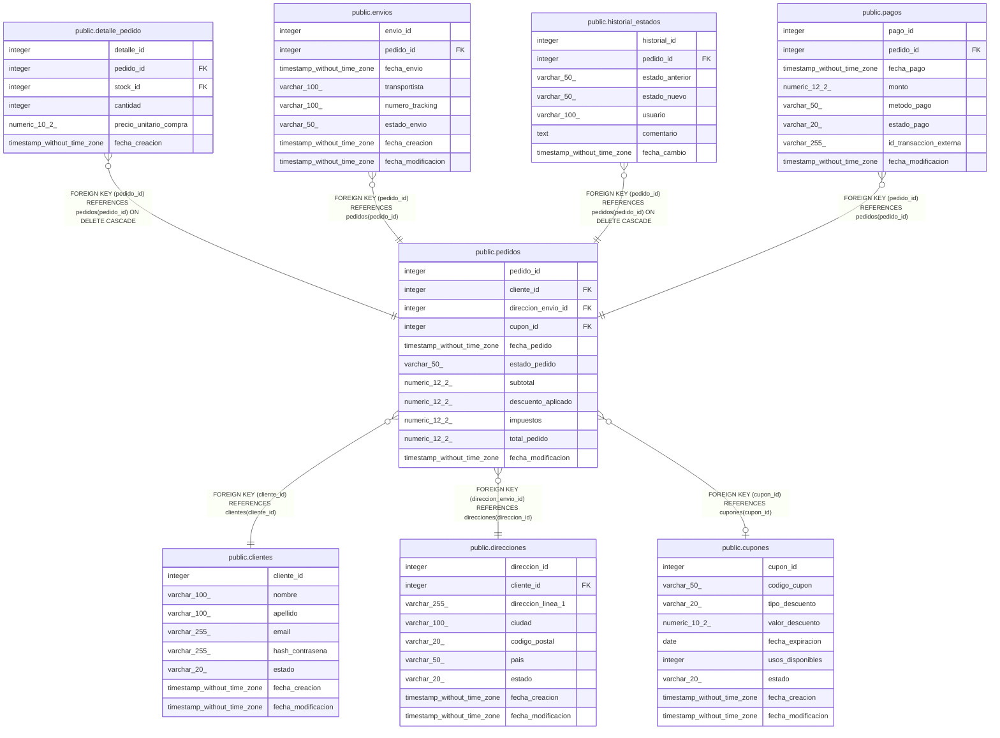

# public.pedidos

## Columns

| Name | Type | Default | Nullable | Children | Parents | Comment |
| ---- | ---- | ------- | -------- | -------- | ------- | ------- |
| pedido_id | integer | nextval('pedidos_pedido_id_seq'::regclass) | false | [public.detalle_pedido](public.detalle_pedido.md) [public.envios](public.envios.md) [public.historial_estados](public.historial_estados.md) [public.pagos](public.pagos.md) |  |  |
| cliente_id | integer |  | false |  | [public.clientes](public.clientes.md) |  |
| direccion_envio_id | integer |  | false |  | [public.direcciones](public.direcciones.md) |  |
| cupon_id | integer |  | true |  | [public.cupones](public.cupones.md) |  |
| fecha_pedido | timestamp without time zone | now() | false |  |  |  |
| estado_pedido | varchar(50) | 'pendiente'::character varying | false |  |  |  |
| subtotal | numeric(12,2) |  | false |  |  |  |
| descuento_aplicado | numeric(12,2) | 0 | false |  |  |  |
| impuestos | numeric(12,2) | 0 | false |  |  |  |
| total_pedido | numeric(12,2) |  | false |  |  |  |
| fecha_modificacion | timestamp without time zone |  | true |  |  |  |

## Constraints

| Name | Type | Definition |
| ---- | ---- | ---------- |
| pedidos_estado_pedido_check | CHECK | CHECK (((estado_pedido)::text = ANY (ARRAY[('pendiente'::character varying)::text, ('pagado'::character varying)::text, ('enviado'::character varying)::text, ('cancelado'::character varying)::text, ('completado'::character varying)::text]))) |
| pedidos_subtotal_check | CHECK | CHECK ((subtotal >= (0)::numeric)) |
| pedidos_total_pedido_check | CHECK | CHECK ((total_pedido >= (0)::numeric)) |
| pedidos_cliente_id_fkey | FOREIGN KEY | FOREIGN KEY (cliente_id) REFERENCES clientes(cliente_id) |
| pedidos_cupon_id_fkey | FOREIGN KEY | FOREIGN KEY (cupon_id) REFERENCES cupones(cupon_id) |
| pedidos_direccion_envio_id_fkey | FOREIGN KEY | FOREIGN KEY (direccion_envio_id) REFERENCES direcciones(direccion_id) |
| pedidos_pkey | PRIMARY KEY | PRIMARY KEY (pedido_id) |

## Indexes

| Name | Definition |
| ---- | ---------- |
| pedidos_pkey | CREATE UNIQUE INDEX pedidos_pkey ON public.pedidos USING btree (pedido_id) |
| idx_pedidos_cliente_estado | CREATE INDEX idx_pedidos_cliente_estado ON public.pedidos USING btree (cliente_id, estado_pedido) |
| idx_pedidos_cliente_id | CREATE INDEX idx_pedidos_cliente_id ON public.pedidos USING btree (cliente_id) |
| idx_pedidos_estado | CREATE INDEX idx_pedidos_estado ON public.pedidos USING btree (estado_pedido) |
| idx_pedidos_fecha | CREATE INDEX idx_pedidos_fecha ON public.pedidos USING btree (fecha_pedido) |
| idx_pedidos_fecha_estado | CREATE INDEX idx_pedidos_fecha_estado ON public.pedidos USING btree (fecha_pedido, estado_pedido) |

## Triggers

| Name | Definition | Comment |
| ---- | ---------- | ------- |
| trg_auditoria_pedidos | CREATE TRIGGER trg_auditoria_pedidos AFTER INSERT OR DELETE OR UPDATE ON public.pedidos FOR EACH ROW EXECUTE FUNCTION fn_auditoria_pedidos() |  |
| trg_pedidos_modificacion | CREATE TRIGGER trg_pedidos_modificacion BEFORE UPDATE ON public.pedidos FOR EACH ROW EXECUTE FUNCTION fn_actualizar_fecha_modificacion() |  |
| trg_registrar_cambio_estado_pedido | CREATE TRIGGER trg_registrar_cambio_estado_pedido AFTER INSERT OR UPDATE OF estado_pedido ON public.pedidos FOR EACH ROW EXECUTE FUNCTION fn_registrar_cambio_estado() | Registra automáticamente cambios de estado en historial_estados para timeline visual. |

## Relations

---

> Generated by [tbls](https://github.com/k1LoW/tbls)
