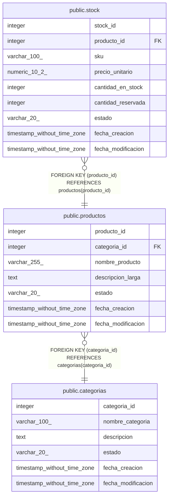

# public.productos

## Columns

| Name | Type | Default | Nullable | Children | Parents | Comment |
| ---- | ---- | ------- | -------- | -------- | ------- | ------- |
| producto_id | integer | nextval('productos_producto_id_seq'::regclass) | false | [public.stock](public.stock.md) |  |  |
| categoria_id | integer |  | false |  | [public.categorias](public.categorias.md) |  |
| nombre_producto | varchar(255) |  | false |  |  |  |
| descripcion_larga | text |  | true |  |  |  |
| estado | varchar(20) | 'activo'::character varying | false |  |  |  |
| fecha_creacion | timestamp without time zone | now() | false |  |  |  |
| fecha_modificacion | timestamp without time zone |  | true |  |  |  |

## Constraints

| Name | Type | Definition |
| ---- | ---- | ---------- |
| productos_estado_check | CHECK | CHECK (((estado)::text = ANY (ARRAY[('activo'::character varying)::text, ('inactivo'::character varying)::text, ('descontinuado'::character varying)::text]))) |
| productos_categoria_id_fkey | FOREIGN KEY | FOREIGN KEY (categoria_id) REFERENCES categorias(categoria_id) |
| productos_pkey | PRIMARY KEY | PRIMARY KEY (producto_id) |

## Indexes

| Name | Definition |
| ---- | ---------- |
| productos_pkey | CREATE UNIQUE INDEX productos_pkey ON public.productos USING btree (producto_id) |
| idx_productos_categoria | CREATE INDEX idx_productos_categoria ON public.productos USING btree (categoria_id) WHERE ((estado)::text = 'activo'::text) |
| idx_productos_nombre | CREATE INDEX idx_productos_nombre ON public.productos USING btree (nombre_producto) |

## Triggers

| Name | Definition |
| ---- | ---------- |
| trg_auditoria_productos | CREATE TRIGGER trg_auditoria_productos AFTER INSERT OR DELETE OR UPDATE ON public.productos FOR EACH ROW EXECUTE FUNCTION fn_auditoria_productos() |
| trg_productos_modificacion | CREATE TRIGGER trg_productos_modificacion BEFORE UPDATE ON public.productos FOR EACH ROW EXECUTE FUNCTION fn_actualizar_fecha_modificacion() |

## Relations

---

> Generated by [tbls](https://github.com/k1LoW/tbls)
