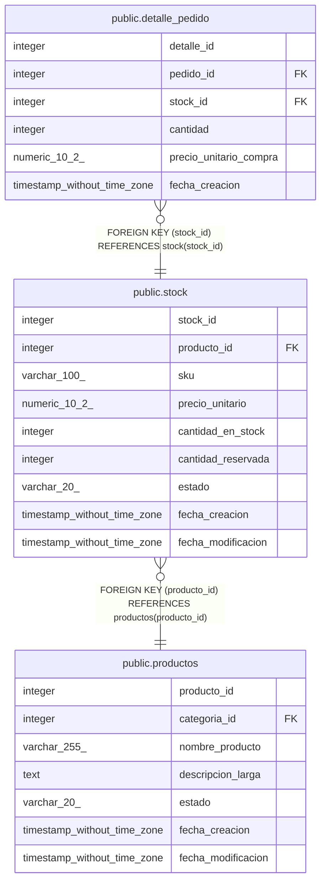

# public.stock

## Columns

| Name | Type | Default | Nullable | Children | Parents | Comment |
| ---- | ---- | ------- | -------- | -------- | ------- | ------- |
| stock_id | integer | nextval('stock_stock_id_seq'::regclass) | false | [public.detalle_pedido](public.detalle_pedido.md) |  |  |
| producto_id | integer |  | false |  | [public.productos](public.productos.md) |  |
| sku | varchar(100) |  | false |  |  |  |
| precio_unitario | numeric(10,2) |  | false |  |  |  |
| cantidad_en_stock | integer | 0 | false |  |  |  |
| cantidad_reservada | integer | 0 | false |  |  |  |
| estado | varchar(20) | 'activo'::character varying | false |  |  |  |
| fecha_creacion | timestamp without time zone | now() | false |  |  |  |
| fecha_modificacion | timestamp without time zone |  | true |  |  |  |

## Constraints

| Name | Type | Definition |
| ---- | ---- | ---------- |
| chk_reserva_stock | CHECK | CHECK ((cantidad_reservada <= cantidad_en_stock)) |
| stock_cantidad_en_stock_check | CHECK | CHECK ((cantidad_en_stock >= 0)) |
| stock_cantidad_reservada_check | CHECK | CHECK ((cantidad_reservada >= 0)) |
| stock_estado_check | CHECK | CHECK (((estado)::text = ANY (ARRAY[('activo'::character varying)::text, ('inactivo'::character varying)::text]))) |
| stock_precio_unitario_check | CHECK | CHECK ((precio_unitario > (0)::numeric)) |
| stock_producto_id_fkey | FOREIGN KEY | FOREIGN KEY (producto_id) REFERENCES productos(producto_id) |
| stock_pkey | PRIMARY KEY | PRIMARY KEY (stock_id) |
| stock_sku_key | UNIQUE | UNIQUE (sku) |

## Indexes

| Name | Definition |
| ---- | ---------- |
| stock_pkey | CREATE UNIQUE INDEX stock_pkey ON public.stock USING btree (stock_id) |
| stock_sku_key | CREATE UNIQUE INDEX stock_sku_key ON public.stock USING btree (sku) |
| idx_stock_estado | CREATE INDEX idx_stock_estado ON public.stock USING btree (estado) |
| idx_stock_producto_estado | CREATE INDEX idx_stock_producto_estado ON public.stock USING btree (producto_id, estado) |
| idx_stock_producto_id | CREATE INDEX idx_stock_producto_id ON public.stock USING btree (producto_id) |
| idx_stock_sku | CREATE INDEX idx_stock_sku ON public.stock USING btree (sku) |

## Triggers

| Name | Definition |
| ---- | ---------- |
| trg_auditoria_stock | CREATE TRIGGER trg_auditoria_stock AFTER INSERT OR DELETE OR UPDATE ON public.stock FOR EACH ROW EXECUTE FUNCTION fn_auditoria_stock() |
| trg_stock_modificacion | CREATE TRIGGER trg_stock_modificacion BEFORE UPDATE ON public.stock FOR EACH ROW EXECUTE FUNCTION fn_actualizar_fecha_modificacion() |

## Relations

---

> Generated by [tbls](https://github.com/k1LoW/tbls)
