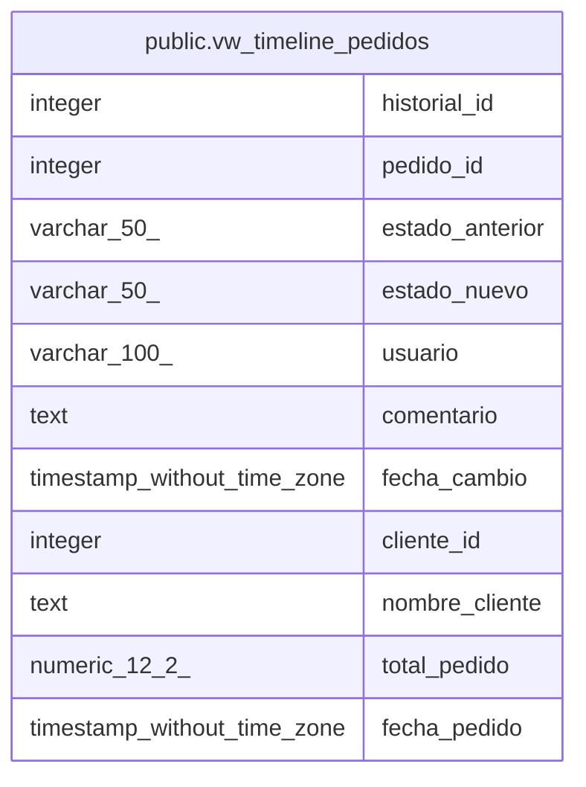

# public.vw_timeline_pedidos

## Description

Vista combinada de historial de estados con información del pedido y cliente.   
Optimizada para listados de actividad reciente.

<details>
<summary><strong>Table Definition</strong></summary>

```sql
CREATE VIEW vw_timeline_pedidos AS (
 SELECT h.historial_id,
    h.pedido_id,
    h.estado_anterior,
    h.estado_nuevo,
    h.usuario,
    h.comentario,
    h.fecha_cambio,
    p.cliente_id,
    (((c.nombre)::text || ' '::text) || (c.apellido)::text) AS nombre_cliente,
    p.total_pedido,
    p.fecha_pedido
   FROM ((historial_estados h
     JOIN pedidos p ON ((h.pedido_id = p.pedido_id)))
     JOIN clientes c ON ((p.cliente_id = c.cliente_id)))
  ORDER BY h.fecha_cambio DESC
)
```

</details>

## Columns

| Name | Type | Default | Nullable | Children | Parents | Comment |
| ---- | ---- | ------- | -------- | -------- | ------- | ------- |
| historial_id | integer |  | true |  |  |  |
| pedido_id | integer |  | true |  |  |  |
| estado_anterior | varchar(50) |  | true |  |  |  |
| estado_nuevo | varchar(50) |  | true |  |  |  |
| usuario | varchar(100) |  | true |  |  |  |
| comentario | text |  | true |  |  |  |
| fecha_cambio | timestamp without time zone |  | true |  |  |  |
| cliente_id | integer |  | true |  |  |  |
| nombre_cliente | text |  | true |  |  |  |
| total_pedido | numeric(12,2) |  | true |  |  |  |
| fecha_pedido | timestamp without time zone |  | true |  |  |  |

## Referenced Tables

| Name | Columns | Comment | Type |
| ---- | ------- | ------- | ---- |
| [public.historial_estados](public.historial_estados.md) | 7 | Historial de cambios de estado para timeline visual de pedidos. <br />Complementa la tabla auditoria con información específica para UX. | BASE TABLE |
| [public.pedidos](public.pedidos.md) | 11 |  | BASE TABLE |
| [public.clientes](public.clientes.md) | 8 |  | BASE TABLE |

## Relations



---

> Generated by [tbls](https://github.com/k1LoW/tbls)
